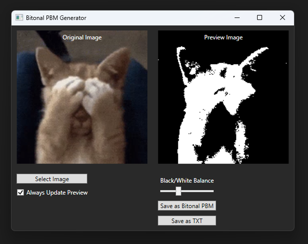

## BitonalPBMGenerator
### This simple tool allows you to convert all kinds of images to Bitonal Portable Bitmaps (.pbm) or their bitonal data (.txt), whilst being able to change its contrast during conversion.
